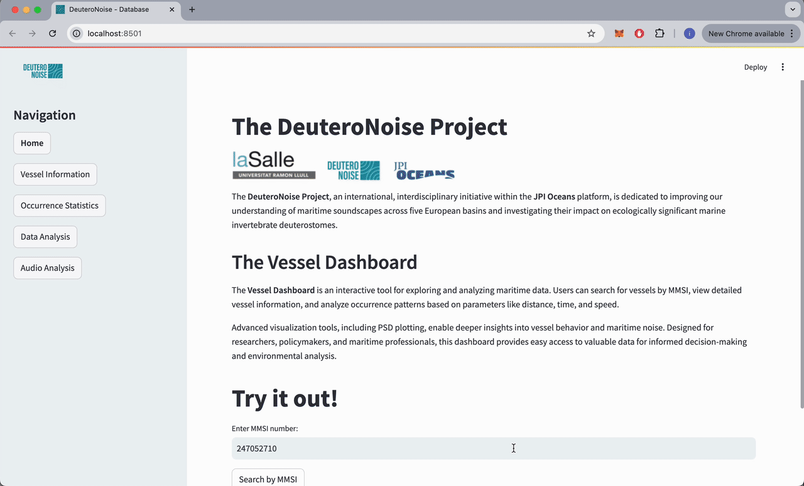
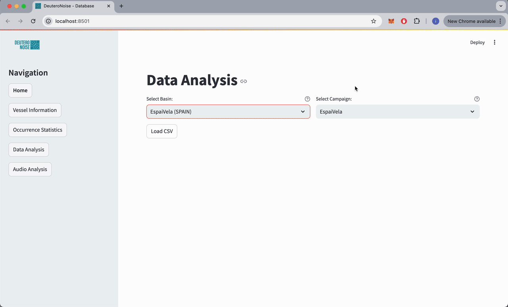

# DeuteroNoise Database — Open Website Dataset (Preview)

> **Status:** Early preview of the forthcoming **DeuteroNoise** open website dataset.  
> This repository hosts a small, sample of audio recordings and metadata.
> This allow reviewers to evaluate the project before the full website and complete dataset go live.

---

## 🔍 Overview

The **DeuteroNoise Database** is a **multi-basin, calibrated underwater sound dataset**
with paired AIS vessel information. It was designed to support research on
anthropogenic noise in the marine environment.

Key features:

- **Calibrated acoustic recordings** (48 kHz / 24-bit) from multiple campaigns:  
  *Barcelona (Badalona & Espai Vela), Venice Lagoon, Black Sea (Mamaia & Constanța)*.
- **Noisy vs quiet** site pairs enabling impact comparisons.
- **AIS-linked vessel metadata** (MMSI, vessel type, distance).

This repo is a **preview** — the full dataset and web platform (searchable,
filterable, with an interactive viewer) will be released on the upcoming
DeuteroNoise website.

---

## 📂 Repository structure

- **`data/campaigns`** — sample campaigns with WAV snippets and metadata.  
- **`docs/demo.mov`** — short video demo of the upcoming web interface.

---

## 🗂️ Campaign samples

| Campaign | Basin / Country | Site type |
|----------|-----------------|-----------|
| BCN_Badalona_Q | Catalan Coast, Spain | Quiet |
| BCN_EspaiVela_N | Catalan Coast, Spain | Noisy |
| IT_Venice_QN   | Venice Lagoon, Italy | Mixed |
| RO_Mamaia_Q    | Black Sea, Romania   | Quiet |
| RO_Constanta_N | Black Sea, Romania   | Noisy |

Each campaign folder contains:

- **audio files**: `audio_*.wav` — placeholder or real samples.
- **metadata**:`[campaign]_metadata.csv` with: `MMSI, vessel_type, distance, start_time, end_time, audio_file`

---

## 🎥 Demo videos

### Landing Page Demo

  

### Get Spectrogram from MMSI

  

### Data Analysis from Campaign

  

### Extended Data Analysis from Campaign

  

---

## 🌐 Full website (coming soon)

The complete database with all audio, metadata, and interactive search tools
will be hosted at:

**<https://deuteronoise.eu>** *(placeholder URL — replace with your real site)*

---